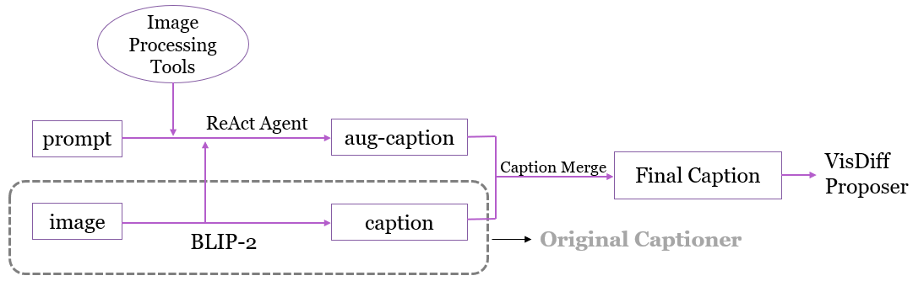

# Captioner-Aug: Towards the Robustness of Image Sets Captioning

This project is an extension of [VisDiff](https://github.com/Understanding-Visual-Datasets/VisDiff), introducing *Captioner-Aug* in replace of the original captioner in VisDiff to capture image quality information in an affordable way. 

As shown below *Captioner-Aug* augments the original captioner using external image processing tools such as FFT-based blur detectors. A [ReAct](https://github.com/ysymyth/ReAct)-style selects one of the user-defined tools based on a prompt, leveraging the reasoning abilities of large language models (LLMs). We implement the agent via [Langchain](https://www.langchain.com/).



## Reproduction
Please first reproduce [VisDiff](https://github.com/Understanding-Visual-Datasets/VisDiff) and follow their instructions to install necessary packages. Then replace ```proposer.py``` in `components/` with our modified version. 

The implementation of our ReAct agent is in `augmented_captioner/`. Please place this folder under the root directory of VisDiff.

To enable *Captioner-Aug*, please set `augmented` to true and `augmented_prompt` to a prompt like "Tell me if the image is blurry or not." in the `proposer` section on the configuration file. Below is an example:
```
base.yaml

proposer:  # LLM Proposer
  ...
  augmented: True  # Enable augmented caption or not
  augmented_prompt: Describe if the image is blurry or not. # Only works if augmented is True
```

Please refer to `configs/base.yaml` for full details.

## Dataset
Please find our evaluation datasets in the [here](https://uofwaterloo-my.sharepoint.com/:f:/g/personal/d72lu_uwaterloo_ca/EoWmVG2EhfVIkwRlgpLeIBgB2SIwt_82yKVGNU_-AJmJcw?e=8rWMir). Note that you have to log into your UWaterloo account to access the dataset.